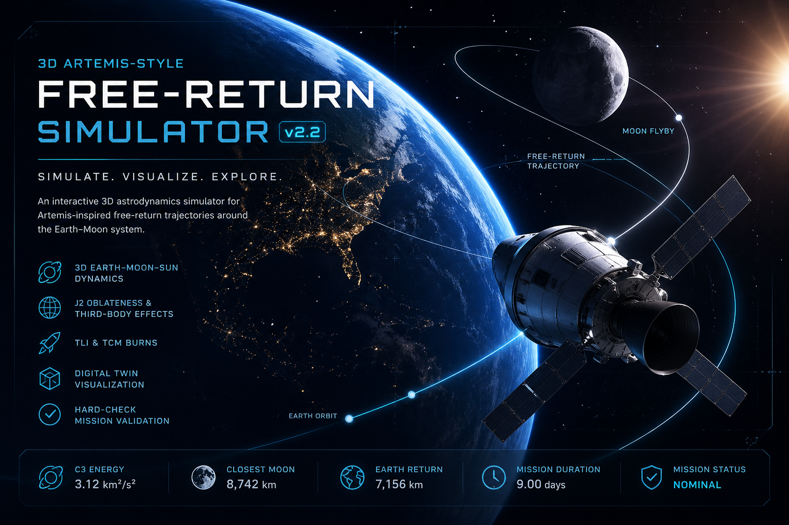

# 🌌🚀 3D Artemis-Style Free-Return Simulator v2.2

> ### 🌍 Simulate. Visualize. Explore.
> An interactive **3D astrodynamics simulator** for **Artemis-inspired free-return trajectories** through the Earth–Moon system.

---

# 🛰️ Overview

The **3D-Artemis-Free-Return-Simulator** is a digital-blue, aerospace-focused orbital mechanics platform built in **Python + Streamlit + Plotly** for exploring translunar injection, lunar flybys, and free-return mission geometry.

This simulator combines **3D visualization**, **Earth-Moon-Sun gravitational dynamics**, and **mission realism diagnostics** into a portfolio-grade educational aerospace project.

---

# 🌠 Core Features

## 🌍 Earth System Modeling
- Earth-centered inertial reference frame
- Realistic circular parking orbit initialization
- Earth point-mass gravity
- J2 oblateness perturbation
- Mission-energy diagnostics

---

## 🌙 Lunar Dynamics
- Approximate elliptical Moon orbit
- Inclined lunar geometry
- Lunar third-body gravity
- Closest-approach flyby analysis
- Free-return trajectory shaping

---

## ☀️ Solar Influence
- Optional Sun third-body perturbation
- Enhanced educational realism for long-duration trajectory evolution

---

# 🚀 Burn Architecture

## 🔥 Trans-Lunar Injection (TLI)
User-controlled:
- TLI Delta-v magnitude
- Radial pitch angle
- Out-of-plane angle

## 🛠️ Trajectory Correction Maneuver (TCM)
User-controlled:
- Tangential Delta-v
- Radial Delta-v
- Normal Delta-v
- Midcourse correction timing

---

# 🤖 3D Digital Twin Visualization
### Includes:
- Stylized spacecraft digital twin
- Earth orbit path
- Lunar flyby geometry
- Return corridor
- Frame-by-frame mission slider
- Interactive 3D Plotly environment

---

# 📊 Mission Dashboard Metrics
### Live outputs include:
- 🌙 Closest Moon Altitude
- 🌍 Closest Earth Return Radius
- ⚡ C3 Characteristic Energy
- 🚀 Total Delta-v
- 🛠️ TCM Delta-v
- 🌌 Relative Lunar Flyby Velocity
- ⏱️ Mission Duration
- 🛡️ PASS / CAUTION / FAIL hard-check status

---

# 🧪 Physics Engine

## Included:
### ✅ 3D Cartesian state propagation  
### ✅ Earth gravity  
### ✅ Earth J2 oblateness  
### ✅ Moon third-body gravity  
### ✅ Sun third-body gravity  
### ✅ DOP853 adaptive integration  
### ✅ Impulsive burns  

---

## Not Yet Included:
### ❌ JPL / NASA SPICE ephemerides  
### ❌ Finite burn thrust curves  
### ❌ Mass depletion  
### ❌ Atmospheric reentry corridor  
### ❌ Differential correction targeting  
### ❌ NASA-certified mission architecture  

---

# 🎨 UI / Design Language
## Digital Blue + Black:
- Neon aerospace dashboard
- Space-grade visual styling
- Professional GitHub portfolio aesthetic
- README banner integration
- Mobile-friendly display

---

# 🏆 Educational + Technical Value

| Category | Rating |
|----------|--------|
| Orbital Mechanics Education | 9/10 |
| Aerospace Visualization | 9.2/10 |
| Physics Realism | 8.5/10 |
| Mission Design Fidelity | 7.5/10 |
| Portfolio / GitHub Value | 9.8/10 |

---

# ⚙️ Installation

```bash
pip install -r requirements.txt
streamlit run app.py

🎮 Quick Start

1️⃣ Set parking orbit altitude

2️⃣ Configure Moon phase

3️⃣ Tune TLI burn

4️⃣ Add TCM

5️⃣ Run simulation

6️⃣ Analyze flyby

7️⃣ Validate return geometry

⸻

📚 Ideal Use Cases

🎓 Aerospace education

🛰️ Astrodynamics demos

🚀 GitHub technical portfolio

🌍 Earth-Moon trajectory exploration

🧠 Artemis mission concept visualization

⸻

📖 Mathematical Foundation

This simulator is based on:

* Newtonian gravitation
* J2 zonal harmonics
* Patched-conic-inspired translunar architecture
* Characteristic energy (C3)
* Orbital frame burn decomposition

⸻

⚠️ Important Disclaimer

This simulator is a high-end educational and portfolio-grade astrodynamics platform, not NASA mission software.
Metrics shown in banner imagery are representative simulator outputs and not official Artemis II mission parameters.

⸻

🔭 Future Upgrades

* SPICE ephemerides
* Lambert targeting
* B-plane targeting
* Finite burn engine models
* Reentry plasma corridor
* Launch window optimization
* Multi-body mission design

⸻

🚀 Simulate boldly.

🌙 Fly by the Moon.

🌍 Return to Earth.


